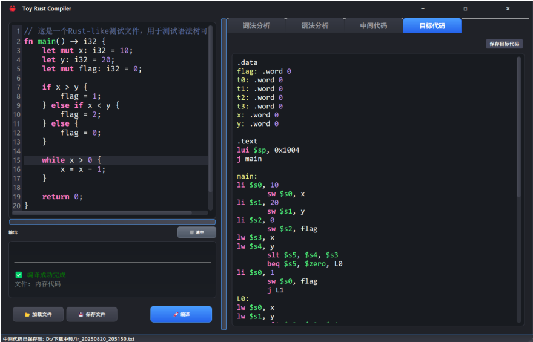
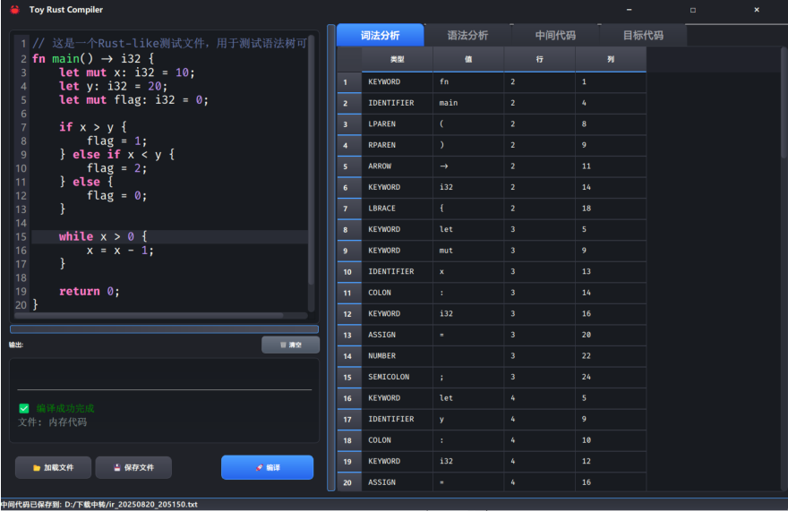
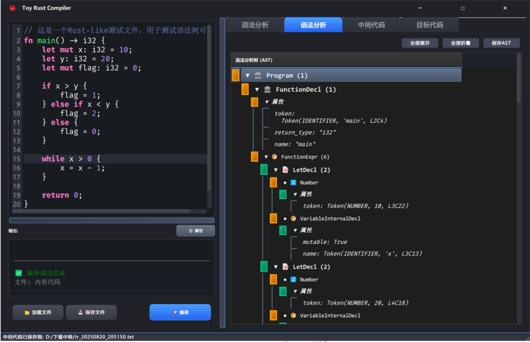
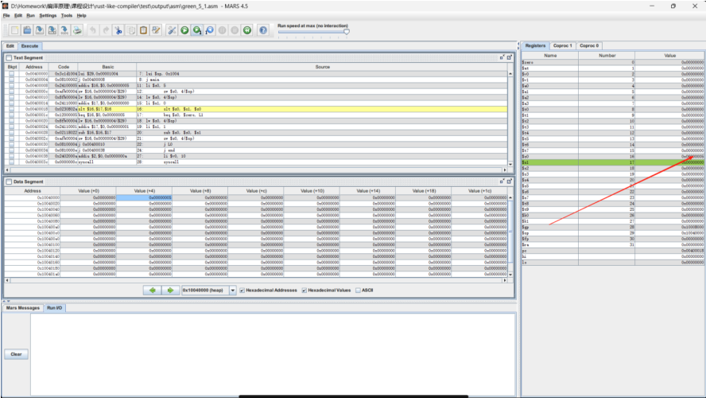
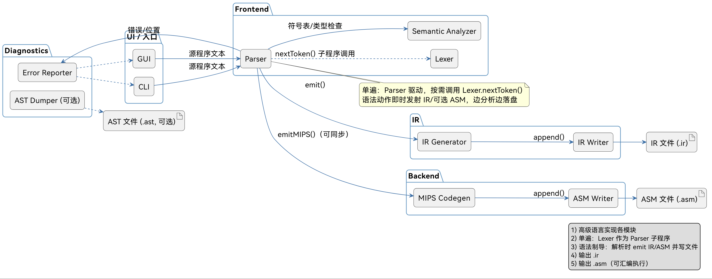

# Toy-Rust-Compiler

2025 年 同济大学编译原理课程设计，类 Rust 编译器

> ☣️ 仅供参考，由于时间紧迫等原因，本项目基于大作业魔改，可能问题较多~

## 📋 项目简介

这是一个基于 Python 实现的类 Rust 语言编译器，支持词法分析、语法分析、语义分析、中间代码生成和 MIPS 汇编代码生成的完整编译流程。项目提供了现代化的图形用户界面和全面的测试框架，实现了课程设计要求的所有编译器功能。

**项目亮点**：

- 🎨 现代化无边框 GUI 界面，自定义标题栏
- 📊 完整的 AST 可视化和多格式输出
- 🧪 测试用例的全面测试覆盖
- 📝 自动生成 AST、中间代码和汇编代码文件






## ✨ 主要特性

### 🔧 编译器核心功能

- **词法分析**：支持 Rust-like 语法的词法单元识别
- **语法分析**：递归下降语法分析器，生成抽象语法树(AST)
- **语义分析**：类型检查、作用域管理、变量声明检查
- **中间代码生成**：生成四元式中间代码
- **目标代码生成**：生成 MIPS 汇编代码



### 🎨 现代化用户界面

- **一体化设计**：无边框窗口，自定义标题栏，渐变主题
- **语法高亮**：代码编辑器支持语法高亮显示
- **可视化 AST**：树形展示抽象语法树结构，支持点击跳转
- **实时错误显示**：HTML 格式化错误信息，支持点击定位错误
- **多标签页**：词法分析、语法分析、中间代码、目标代码分离显示

### 📁 多格式文件输出

- **AST 文件 (.ast)**：格式化的抽象语法树文本表示，带时间戳
- **中间代码文件 (.ir)**：四元式中间表示代码
- **汇编文件 (.asm)**：MIPS 汇编代码

### 💡 支持的语言特性

- 函数定义和调用
- 变量声明（支持 `let` 和 `let mut`）
- 基本数据类型（`i32`, `f32`, `bool`, `char`）
- 数组和切片
- 控制流语句（`if-else`, `while`, `for`, `loop`）
- 表达式计算
- 作用域和变量遮蔽

## 🚀 快速开始

### 环境要求

- Python 3.9+
- PyQt5

### 安装与运行

1. **克隆项目**

```bash
git clone https://github.com/Flesymeb/Toy-Rust-Compiler.git
cd Toy-Rust-Compiler
```

2. **安装依赖**

```bash
pip install PyQt5
# 或使用 conda
conda install pyqt
```

3. **运行编译器**

```bash
python gui.py
```

### 使用方法

#### 🖥️ GUI 界面使用

1. **启动程序**：运行 `python gui.py`
2. **编写代码**：在左侧代码编辑器中输入类 Rust 代码
3. **编译运行**：点击"编译"按钮开始编译
4. **查看结果**：
   - **词法分析**：查看词法单元表
   - **语法分析**：查看 AST 语法树可视化
   - **中间代码**：查看四元式中间代码
   - **目标代码**：查看生成的 MIPS 汇编
5. **错误处理**：底部错误面板显示编译错误，点击可跳转到错误位置

#### 📟 命令行使用

```bash
# 编译单个文件，自动生成所有输出格式
python main.py test/green_1_1.rs

# 输出文件将保存到：
# - test/output/ast/green_1_1.ast     (AST文件)
# - test/output/ir/green_1_1.ir       (中间代码)
# - test/output/asm/green_1_1.asm     (汇编代码)
```

## 📁 项目结构

```
rust-like-compiler/
├── gui.py                     # 现代化GUI主程序
├── main.py                    # 命令行编译器，支持多格式输出
├── lexer.py                   # 词法分析器
├── parser.py                  # 递归下降语法分析器
├── parser_nodes.py            # AST节点类定义
├── semantic_analyzer.py       # 语义分析器
├── symbol_table.py            # 符号表管理
├── ir_generator.py            # 中间代码生成器
├── codegen2mips.py            # MIPS汇编代码生成器
├── compile_all_test_cases.bat # 批量测试脚本
├── grammar.txt                # 语法规则BNF定义
├── test/                      # 测试用例目录
│   ├── green_*.rs            # 基础功能测试
│   ├── blue_*.rs             # 复杂功能测试
│   ├── error_*.rs            # 错误测试用例
│   └── output/               # 编译输出目录
│       ├── ast/              # AST文件输出
│       ├── ir/               # 中间代码输出
│       └── asm/              # 汇编代码输出
└── README.md                 # 项目文档
```

## 🧪 测试用例

使用提供的批量测试脚本

```bash
# 测试所有用例
compile_all_test_cases.bat

# 分类测试
compile_all_test_cases.bat --green    # 仅测试green系列
compile_all_test_cases.bat --blue     # 仅测试blue系列
compile_all_test_cases.bat --error    # 仅测试error系列

# 单个文件测试
compile_all_test_cases.bat green_1_1.rs

# 查看帮助
compile_all_test_cases.bat --help
```

## 🎯 语法支持示例

```rust
fn main() -> i32 {
    let mut x: i32 = 10;
    let y: i32 = 20;
    let mut flag: i32 = 0;

    if x > y {
        flag = 1;
    } else if x < y {
        flag = 2;
    } else {
        flag = 0;
    }

    while x > 0 {
        x = x - 1;
    }

    return 0;
}
```

- **语法规则文档**：`grammar.txt` - 完整的 BNF 语法定义
- **输出文件格式**：
  - AST 文件：层次化文本格式，包含节点类型和位置信息
  - IR 文件：四元式中间代码表示
  - ASM 文件：MIPS 汇编指令

_同济大学编译原理课程设计 © 2025_
